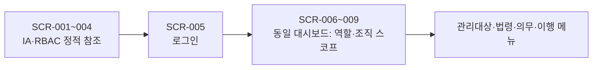
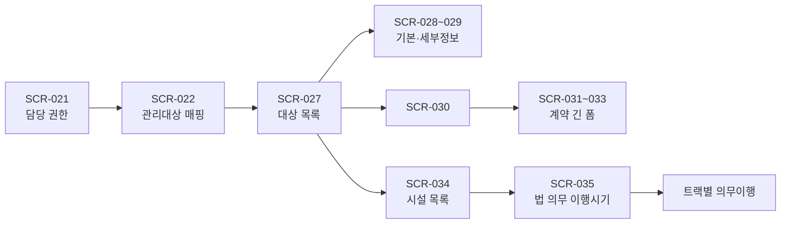
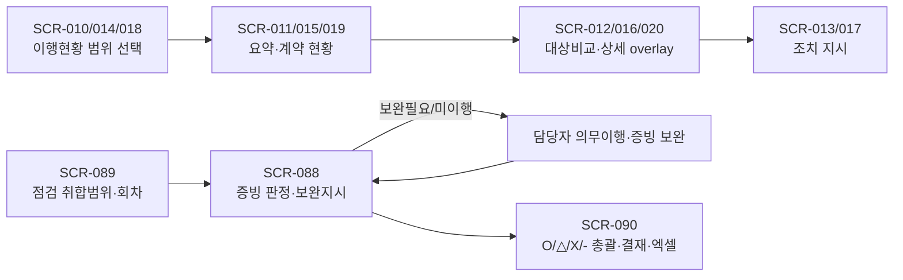

# ADOMS 102-Screen Flow Map — 영구 화면 자산 참조서

**문서 목적.** 이 문서는 ADOMS 원본 설계의 `SCR-001`~`SCR-102`를 빠짐없이 자산·업무순서·역할·상태·재사용 패턴·데이터 경계에 연결하는 구현 기준이다. 화면 컷(part)은 대부분 동일 route의 스크롤, 모달 또는 조건 상태이므로 102개의 URL을 뜻하지 않는다. 용인시 영업 시연의 투영 범위·갭 판단은 별도 교차표를 우선한다.

**자산 기준 경로:** `/home/ubuntu/projects/project-5908de38/_adoms_demo_spec/images/`. `SCREENS.csv`의 논리명 `images/imgNNN.png`와 동일 번호의 설명형 PNG를 함께 기록한다. 아래 권장 route는 원본에 URL이 없으므로 **구현용 논리 식별자**이며, 원본 URL의 주장이나 신규 화면 설계가 아니다.

## 1. 판독 원칙과 검산

| 항목 | 확정 기준 |
|---|---|
| 원본 범위 | `SCREENS.csv`의 연속 `SCR-001`~`SCR-102`, 총 **102개**. 논리 자산은 `images/img001.png`~`images/img102.png`이다. |
| 대표 원본 | 각 행에 **리네이밍 PNG 파일명**과 논리 이미지명을 병기했다. 구현 전 해당 PNG를 열어 육안 검수한다. |
| route 판정 | `part=2`, `(계속)`, 설계 주석, 모달, 조건 토글은 별도 route로 증식하지 않는다. 다만 part 값만으로 단정하지 않고 영역 분석의 상태 판정을 적용했다. |
| 공통 키 | 모든 업무 기록은 최소 `target_id`, `duty_item_id`, `year`, 작성자/조직 스코프를 가진다. 권한 키는 `role_level` 단독이 아니라 **`(role_level, disaster_type)`**이다. |
| 시연 한계 | 용인시청 **단일 대상**의 Supabase ADOMS 투영에서는 기준 법령은 읽기 전용, 적용판정·이행·증빙·점검 상태는 저장한다. |

**자체 검산:** 번호 1–102를 CSV에서 순서·연속성으로 검증해 `102/102`를 표에 출력했다. 카탈로그 행 수 **102**, 누락 **0**, 중복 **0**이다. (`SCR-001/002`의 part 역순은 원문 메타데이터이며 번호 누락이 아니다.)

## 2. 실제 업무순 플로우

### 2.1 정보구조·권한·인증

`SCR-001~004`는 배포 UI가 아니라 메뉴 정책·RBAC의 원천이다. `SCR-005`만 인증 route이고, `SCR-006~009`는 하나의 `DashboardPage`에 전 기관/소관조직/지정대상 집계를 주입한 네 상태다. 경영책임자와 담당부서는 전 기관, 사업소·실/국은 하위 조직, 사업장·부서는 `user_target_map`으로 제한한다.

### 2.2 등록→법령/의무→실적의 기본 온보딩

관리자용 `SCR-021~026`은 전 기관 매핑·마스터·감사 조회이고, 담당자용 `SCR-027~035`는 본인 관리대상 입력이다. `SCR-028/029`, `SCR-031/032/033`은 각각 하나의 draft와 저장 단위를 공유한다. `SCR-035`의 법→시행령→의무 트리와 `DATE_YM`/`HALF_YEAR`가 이후 `duty_record` 생성을 위한 기준이다.

### 2.3 세 대상 트랙의 의무이행

| 대상 트랙 | 업무 순서와 원본 컷 | 실제 route 규칙 | 대표 데이터 |
|---|---|---|---|
| **사업장 / 중대산업재해** | `036 → 037 → 038/039 → 040/041 → 042/043 → 044/045 → 046/047 → 048/049 → 050/051 → 052 → 053/054 → 055/056` | 038/039 등은 상·하 스크롤, 051은 050의 무재해 ON, 052는 같은 재발방지 route의 하단, 054는 053의 해당없음 ON | `duty_record`, 항목별 detail, `duty_evidence`, `not_applicable`/`no_accident_history` |
| **공중이용시설·교통수단 / 중대시민재해** | `057/058 → 059 → 060 → 061/062 → 063/064/065 → 066/067 → 068/069 → 070/071/072/073/074` | 062·064·071~074는 모달, 067·069는 조건 상태, 070은 블록 A/B 각각 저장 | 시설 `target_id`, `plan_record`, `law`, 법령선택 snapshot, 증빙 |
| **원료·제조물 / 중대시민재해** | `075/076 → 077/078/079 → 080/081 → 082/083 → 084/085 → 086/087` | 076·078은 불러오기 모달, 079·081·087은 동일 route 하단/섹션, 083·085는 조건 상태 | 물질/제품 `target_id`, 예산·위험요인·사고 카드·교육 명부·증빙 |

세 트랙 모두 ‘템플릿 3벌’이 아니라 `track`, `duty_item`, `input_schema`, `target_id`를 주입하는 공통 프레임이어야 한다. 단, 실제 표 저장 단위가 다른 항목(예: 046의 두 표, 060의 두 표, 070의 A/B 블록)은 한 JSON 폼으로 평탄화하지 않는다.

### 2.4 현황→점검→보완→결재의 폐루프

`SCR-010~020`은 총괄 조회·조치 지시이고, `SCR-089 → SCR-088 → SCR-090`은 실제 점검 회차 흐름이다. 번호상 088이 089보다 앞서도 업무상 089가 선행한다. `해당없음(-)`은 이행률 분모에서 제외하는 관측식이지만 절사/반올림과 상태 전환 정책은 확정 전 설정값으로 둔다.

### 2.5 통계·사례·법령 집계

`SCR-091~094`는 하나의 발생 원장/하단 차트 route, `SCR-095/096`은 3패널 대상 통계, `SCR-097~101`은 목록 위 레이어 스택, `SCR-102`는 양측 독립 법령 집계다. 통계의 업로드·내보내기와 사고사례 CRUD는 시연의 7 route 핵심범위와 별개다. 기능 미구현 상태에서는 살아 있는 버튼을 노출하지 않는다.

## 3. 화면 부재 메뉴와 유사 화면의 엄격한 분리

| 구분 | 원본에 있는 가까운 컷 | 결론 |
|---|---|---|
| **기관장 예방활동** | SCR-003에는 권한 칸이 공란, SCR-026은 ‘경영책임자 점검/조치 활동기록 **관리**’ 감사조회일 뿐 | 별도 사용자 입력·목록 화면은 **없다**. SCR-026을 기관장 예방활동 화면으로 대체하지 않는다. |
| **게시판** | SCR-002 IA에는 게시판이 있으나 로그인 GNB는 관리자; SCR-097~101은 ‘중대재해 사고사례’ 정보센터 게시판 | 일반 `게시판`의 원본 화면은 **없다**. 사고사례 CRUD를 공지/게시판의 근거로 전용하지 않는다. |
| **관리자** | SCR-021~026은 ‘중대재해 담당부서(관리자)’가 관리대상 현황 안에서 쓰는 화면 | GNB `관리자`/IA `시스템 관리자`의 독립 화면 설계는 **없다**. 담당부서 관리자 화면과 시스템 관리자 메뉴를 혼동하지 않는다. |

## 4. 재사용 패턴 및 DB 엔티티 사전

| 패턴 | 대표 SCR | 영구 데이터 경계 |
|---|---|---|
| 공통 셸·권한 스코프 | 005~009 | `user`, `org`, `role_capability`, `user_target_map`, `notification` |
| 선택/취합과 가변 매트릭스 | 010~017, 089~090 | `collection_scope`, `inspection`, `inspection_item`, `action_order`; 선택 대상 수는 열 수를 결정 |
| 관리자 매핑·마스터 | 021~026 | 사용자 권한/대상 매핑, 법령 마스터, `ceo_activity`, 변경 감사로그 |
| 대상·계약 마스터 | 027~033 | 대상 이력, 인원, 계약, 위험작업 코드, 계약 준수/첨부 |
| 법 의무 트리/시기 | 034~035 | `law`, `target_law`, `duty_item`, `facility_duty_schedule`; 입력형(`DATE_YM`/`HALF_YEAR`)은 마스터 속성 |
| 의무 실적·증빙 | 036~087 | 상위 `duty_record` + 항목별 detail + `duty_evidence`; 원본 법령/계획을 가져오면 ID·문자열 snapshot·선택시각 보존 |
| 증빙 | 020, 029, 033, 036~087, 088 | `object_key`, 원파일명, MIME, 크기, 버전, 업로더, 권한, 삭제시각; 원본 표기는 대체로 건당 10MB |
| 사고/통계/사례 | 091~102 | `accident_occurrence`, `upload_batch`, `case_post`, `case_attachment`, `export_job`, 법령 집계 query |

## 5. 번호순 102-SCR 자산 카탈로그

> 표의 **대표 원본 화면** 열이 구현자가 재탐색해야 할 정확한 PNG다. 이미지명은 파일 시스템의 리네이밍명이고, 그 앞의 `images/imgNNN.png`는 CSV 논리명이다. `상태`라 적힌 행은 독립 route가 아니라 직전/기준 route의 UI 상태다.

| SCR | 대표 원본 화면 (논리명 ↔ 리네이밍 PNG) | 공식 캡션 | 역할 | 권장 논리 route / 상태 | 재사용 패턴 | DB 엔티티 |
|---|---|---|---|---|---|---|
| SCR-001 | `images/img001.png` [001_메뉴구조도.png](file:///home/ubuntu/projects/project-5908de38/_adoms_demo_spec/images/001_메뉴구조도.png) |  | 기능별·제공내용 정적 설명표 | `reference/feature-map` · 비라우트 | `StaticFeatureMatrix` | `menu_feature`, `menu_policy` |
| SCR-002 | `images/img002.png` [002_메뉴구조도.png](file:///home/ubuntu/projects/project-5908de38/_adoms_demo_spec/images/002_메뉴구조도.png) |  | 전체 메뉴 계층의 IA 원천 | `reference/menu-tree` · 비라우트 | `StaticMenuTree` | `menu_policy`, `route_policy` |
| SCR-003 | `images/img003.png` [003_사용자 권한 구분.png](file:///home/ubuntu/projects/project-5908de38/_adoms_demo_spec/images/003_사용자 권한 구분.png) |  | 메뉴×4 사용자유형 권한 정적 매트릭스 | `reference/rbac-matrix` · 비라우트 | `RolePermissionMatrix` | `role_capability`, `menu_policy` |
| SCR-004 | `images/img004.png` [004_사용자 권한 구분.png](file:///home/ubuntu/projects/project-5908de38/_adoms_demo_spec/images/004_사용자 권한 구분.png) |  | 권한코드×재해유형 조직스코프 정적 체계 | `reference/role-level` · 비라우트 | `RoleScopeDictionary` | `user.role_level`, `user.disaster_type`, `org` |
| SCR-005 | `images/img005.png` [005_로그인.png](file:///home/ubuntu/projects/project-5908de38/_adoms_demo_spec/images/005_로그인.png) | 로그인 | 익명 사용자 인증 및 세션 시작 | `/login` · 기본 | `PublicHeader + LoginForm` | `user`, `auth_session`, `org` |
| SCR-006 | `images/img006.png` [006_메인(대시보드) - (경영책임자, 총괄) 로그인 시.png](file:///home/ubuntu/projects/project-5908de38/_adoms_demo_spec/images/006_메인(대시보드) - (경영책임자, 총괄) 로그인 시.png) | 메인(대시보드) - [경영책임자, 총괄] 로그인 시 | 경영책임자·총괄 전 기관 조회 | `/dashboard` · RoleScopeResolver 상태 | `DashboardPage + KPI widgets` | `user`, `org`, `user_target_map`, `target`, `duty_record`, `deadline`, `notification` |
| SCR-007 | `images/img007.png` [007_메인(대시보드) - (중대재해 담당부서) 로그인 시.png](file:///home/ubuntu/projects/project-5908de38/_adoms_demo_spec/images/007_메인(대시보드) - (중대재해 담당부서) 로그인 시.png) | 메인(대시보드) - [중대재해 담당부서] 로그인 시 | 중대재해 담당부서 전 기관 조회 | `/dashboard` · RoleScopeResolver 상태 | `DashboardPage + KPI widgets` | `user`, `org`, `user_target_map`, `target`, `duty_record`, `deadline`, `notification` |
| SCR-008 | `images/img008.png` [008_메인(대시보드) - (사업소, 실/국) 로그인 시.png](file:///home/ubuntu/projects/project-5908de38/_adoms_demo_spec/images/008_메인(대시보드) - (사업소, 실/국) 로그인 시.png) | 메인(대시보드) - [사업소, 실/국] 로그인 시 | 사업소·실/국 소관조직 조회 | `/dashboard` · RoleScopeResolver 상태 | `DashboardPage + KPI widgets` | `user`, `org`, `user_target_map`, `target`, `duty_record`, `deadline`, `notification` |
| SCR-009 | `images/img009.png` [009_메인(대시보드) - (사업장, 부서) 로그인 시.png](file:///home/ubuntu/projects/project-5908de38/_adoms_demo_spec/images/009_메인(대시보드) - (사업장, 부서) 로그인 시.png) | 메인(대시보드) - [사업장, 부서] 로그인 시 | 사업장·부서 지정대상 조회 | `/dashboard` · RoleScopeResolver 상태 | `DashboardPage + KPI widgets` | `user`, `org`, `user_target_map`, `target`, `duty_record`, `deadline`, `notification` |
| SCR-010 | `images/img010.png` [010_이행현황 – (총괄, 담당부서) 중대산업재해 : 대상 및 취합정보 항목 선택.png](file:///home/ubuntu/projects/project-5908de38/_adoms_demo_spec/images/010_이행현황 – (총괄, 담당부서) 중대산업재해 : 대상 및 취합정보 항목 선택.png) | 이행현황 – [총괄, 담당부서] 중대산업재해 : 대상 및 취합정보 항목 선택 | 중대산업재해 취합 대상과 점검항목 다중 선택 | `/implementation/industrial/scope` · 기본 | `CollectionTargetPicker` | `target`, `org`, `duty_item`, `collection_scope` |
| SCR-011 | `images/img011.png` [011_이행현황 – (총괄, 담당부서) 중대산업재해 : 선택항목에 대한 해당년도 이행 현황표.png](file:///home/ubuntu/projects/project-5908de38/_adoms_demo_spec/images/011_이행현황 – (총괄, 담당부서) 중대산업재해 : 선택항목에 대한 해당년도 이행 현황표.png) | 이행현황 – [총괄, 담당부서] 중대산업재해 : 선택항목에 대한 해당년도 이행 현황표 | 중대산업재해 선택항목 연도별 집계 | `/implementation/industrial/summary` · 요약뷰 | `ComplianceSummaryTable` | `duty_record`, `duty_item`, `target`, `org` |
| SCR-012 | `images/img012.png` [012_이행현황 – (총괄, 담당부서) 중대산업재해 : 선택항목에 대한 대상별 이행 현황표.png](file:///home/ubuntu/projects/project-5908de38/_adoms_demo_spec/images/012_이행현황 – (총괄, 담당부서) 중대산업재해 : 선택항목에 대한 대상별 이행 현황표.png) | 이행현황 – [총괄, 담당부서] 중대산업재해 : 선택항목에 대한 대상별 이행 현황표 | 중대산업재해 대상별 상태 비교·조치지시 진입 | `/implementation/industrial/summary?view=targets` · 확장뷰 | `TargetComparisonMatrix` | `duty_record`, `duty_item`, `target`, `org`, `action_order` |
| SCR-013 | `images/img013.png` [013_이행현황 – (총괄, 담당부서) 중대산업재해 : 이행현황 확인에 따른 조치 지시.png](file:///home/ubuntu/projects/project-5908de38/_adoms_demo_spec/images/013_이행현황 – (총괄, 담당부서) 중대산업재해 : 이행현황 확인에 따른 조치 지시.png) | 이행현황 – [총괄, 담당부서] 중대산업재해 : 이행현황 확인에 따른 조치 지시 | 저이행 대상 수신자 선택 및 조치 메시지 발신 | `SCR-012` 위 `ActionOrderModal` | `ActionOrderModal` | `action_order`, `action_order_recipient`, `notification`, `audit_log` |
| SCR-014 | `images/img014.png` [014_이행현황 – (총괄, 담당부서) 중대시민재해 : 대상 및 취합정보 항목 선택.png](file:///home/ubuntu/projects/project-5908de38/_adoms_demo_spec/images/014_이행현황 – (총괄, 담당부서) 중대시민재해 : 대상 및 취합정보 항목 선택.png) | 이행현황 – [총괄, 담당부서] 중대시민재해 : 대상 및 취합정보 항목 선택 | 중대시민재해 취합 대상과 점검항목 다중 선택 | `/implementation/civil/scope` · 기본 | `CollectionTargetPicker` | `target`, `org`, `duty_item`, `collection_scope` |
| SCR-015 | `images/img015.png` [015_이행현황 – (총괄, 담당부서) 중대시민재해 : 선택항목에 대한 해당년도 이행 현황표.png](file:///home/ubuntu/projects/project-5908de38/_adoms_demo_spec/images/015_이행현황 – (총괄, 담당부서) 중대시민재해 : 선택항목에 대한 해당년도 이행 현황표.png) | 이행현황 – [총괄, 담당부서] 중대시민재해 : 선택항목에 대한 해당년도 이행 현황표 | 중대시민재해 선택항목 연도별 집계 | `/implementation/civil/summary` · 요약뷰 | `ComplianceSummaryTable` | `duty_record`, `duty_item`, `target`, `org` |
| SCR-016 | `images/img016.png` [016_이행현황 – (총괄, 담당부서) 중대시민재해 : 선택항목에 대한 대상별 이행 현황표.png](file:///home/ubuntu/projects/project-5908de38/_adoms_demo_spec/images/016_이행현황 – (총괄, 담당부서) 중대시민재해 : 선택항목에 대한 대상별 이행 현황표.png) | 이행현황 – [총괄, 담당부서] 중대시민재해 : 선택항목에 대한 대상별 이행 현황표 | 중대시민재해 대상별 상태 비교·조치지시 진입 | `/implementation/civil/summary?view=targets` · 확장뷰 | `TargetComparisonMatrix` | `duty_record`, `duty_item`, `target`, `org`, `action_order` |
| SCR-017 | `images/img017.png` [017_이행현황 – (총괄, 담당부서) 중대시민재해 : 이행현황 확인에 따른 조치 지시.png](file:///home/ubuntu/projects/project-5908de38/_adoms_demo_spec/images/017_이행현황 – (총괄, 담당부서) 중대시민재해 : 이행현황 확인에 따른 조치 지시.png) | 이행현황 – [총괄, 담당부서] 중대시민재해 : 이행현황 확인에 따른 조치 지시 | 저이행 대상 수신자 선택 및 조치 메시지 발신 | `SCR-016` 위 `ActionOrderModal` | `ActionOrderModal` | `action_order`, `action_order_recipient`, `notification`, `audit_log` |
| SCR-018 | `images/img018.png` [018_이행현황 – (총괄, 담당부서) 도급·용역·위탁 : 대상 항목 선택.png](file:///home/ubuntu/projects/project-5908de38/_adoms_demo_spec/images/018_이행현황 – (총괄, 담당부서) 도급·용역·위탁 : 대상 항목 선택.png) | 이행현황 – [총괄, 담당부서] 도급·용역·위탁 : 대상 항목 선택 | 도급·용역·위탁 조회 대상 사업장 선택 | `/implementation/contracts/scope` · 기본 | `SingleTargetPicker` | `target`, `contract` |
| SCR-019 | `images/img019.png` [019_이행현황 – (총괄, 담당부서) 도급·용역·위탁 : 선택항목에 대한 이행 현황표.png](file:///home/ubuntu/projects/project-5908de38/_adoms_demo_spec/images/019_이행현황 – (총괄, 담당부서) 도급·용역·위탁 : 선택항목에 대한 이행 현황표.png) | 이행현황 – [총괄, 담당부서] 도급·용역·위탁 : 선택항목에 대한 이행 현황표 | 선택 사업장의 계약별 O/X 안전관리 현황 | `/implementation/contracts` · 아코디언 | `ContractComplianceAccordion` | `contract`, `contract_duty`, `contract_compliance_check` |
| SCR-020 | `images/img020.png` [020_이행현황 – (총괄, 담당부서) 도급·용역·위탁 : 선택항목에 대한 상세 정보.png](file:///home/ubuntu/projects/project-5908de38/_adoms_demo_spec/images/020_이행현황 – (총괄, 담당부서) 도급·용역·위탁 : 선택항목에 대한 상세 정보.png) | 이행현황 – [총괄, 담당부서] 도급·용역·위탁 : 선택항목에 대한 상세 정보 | 선택 계약 기본정보 읽기전용 상세 | `SCR-019` 위 `selectedContractId` 오버레이 | `ContractBasicInfoCard` | `contract`, `contract_file` |
| SCR-021 | `images/img021.png` [021_관리대상 현황 – (중대재해 담당부서(관리자)) 중대산업재해 담당자 지정.png](file:///home/ubuntu/projects/project-5908de38/_adoms_demo_spec/images/021_관리대상 현황 – (중대재해 담당부서(관리자)) 중대산업재해 담당자 지정.png) | 관리대상 현황 – [중대재해 담당부서(관리자)] 중대산업재해 담당자 지정 | 산업재해 담당자 권한 지정/해제 | `/admin/industrial/assignees` · 기본 | `TransferListPanel` | `user`, `org`, `user_role_assignment`, `audit_log` |
| SCR-022 | `images/img022.png` [022_관리대상 현황 – (중대재해 담당부서(관리자)) 중대산업재해 관리대상 지정.png](file:///home/ubuntu/projects/project-5908de38/_adoms_demo_spec/images/022_관리대상 현황 – (중대재해 담당부서(관리자)) 중대산업재해 관리대상 지정.png) | 관리대상 현황 – [중대재해 담당부서(관리자)] 중대산업재해 관리대상 지정 | 선택 담당자별 사업장·부서 매핑 | `/admin/industrial/target-map` · master-detail | `MasterDetailMappingView` | `user_target_map`, `user`, `target` |
| SCR-023 | `images/img023.png` [023_관리대상 현황 – (중대재해 담당부서(관리자)) 중대산업재해 사업장 기본정보 등록/관리.png](file:///home/ubuntu/projects/project-5908de38/_adoms_demo_spec/images/023_관리대상 현황 – (중대재해 담당부서(관리자)) 중대산업재해 사업장 기본정보 등록/관리.png) | 관리대상 현황 – [중대재해 담당부서(관리자)] 중대산업재해 사업장 기본정보 등록/관리 | 관리자 사업장 기본정보·관리체계 상태 수정 | `/admin/industrial/workplaces/{id}` · 편집 | `LabeledFormGrid + StatusSelectGrid` | `target`, `workplace_info_history`, `workplace_headcount` |
| SCR-024 | `images/img024.png` [024_관리대상 현황 – (중대재해 담당부서(관리자)) 중대산업재해 관련법령 등록/관리.png](file:///home/ubuntu/projects/project-5908de38/_adoms_demo_spec/images/024_관리대상 현황 – (중대재해 담당부서(관리자)) 중대산업재해 관련법령 등록/관리.png) | 관리대상 현황 – [중대재해 담당부서(관리자)] 중대산업재해 관련법령 등록/관리 | 중대산업재해 관계법령 검색·마스터 관리 | `/admin/laws?disaster=industrial` · 목록/필터 | `LawManagementList` | `law`, `law_target_type_map`, `law_version` |
| SCR-025 | `images/img025.png` [025_관리대상 현황 – (중대재해 담당부서(관리자)) 중대시민재해 관련법령 등록/관리.png](file:///home/ubuntu/projects/project-5908de38/_adoms_demo_spec/images/025_관리대상 현황 – (중대재해 담당부서(관리자)) 중대시민재해 관련법령 등록/관리.png) | 관리대상 현황 – [중대재해 담당부서(관리자)] 중대시민재해 관련법령 등록/관리 | 중대시민재해 관계법령 검색·마스터 관리 | `/admin/laws?disaster=civil` · 목록/필터 | `LawManagementList` | `law`, `law_target_type_map`, `law_version` |
| SCR-026 | `images/img026.png` [026_관리대상 현황 – (중대재해 담당부서(관리자)) 경영책임자 점검/조치 활동기록 관리.png](file:///home/ubuntu/projects/project-5908de38/_adoms_demo_spec/images/026_관리대상 현황 – (중대재해 담당부서(관리자)) 경영책임자 점검/조치 활동기록 관리.png) | 관리대상 현황 – [중대재해 담당부서(관리자)] 경영책임자 점검/조치 활동기록 관리 | 경영책임자 점검·조치 활동 감사 조회 | `/admin/ceo-activities` · 상세검색 팝오버 | `ActivityLog + AdvancedSearchPopover` | `ceo_activity`, `audit_log`, `user`, `target` |
| SCR-027 | `images/img027.png` [027_관리대상 현황 – (사업장, 부서) 관리대상 선택.png](file:///home/ubuntu/projects/project-5908de38/_adoms_demo_spec/images/027_관리대상 현황 – (사업장, 부서) 관리대상 선택.png) | 관리대상 현황 – [사업장, 부서] 관리대상 선택 | 담당자 소관 관리대상 선택 및 입력현황 조회 | `/targets` · 목록 | `TargetList + StatSplitCard` | `target`, `user_target_map`, `workplace_info_history` |
| SCR-028 | `images/img028.png` [028_관리대상 현황 – (사업장, 부서) 관리대상에 대한 기본정보 등록/관리.png](file:///home/ubuntu/projects/project-5908de38/_adoms_demo_spec/images/028_관리대상 현황 – (사업장, 부서) 관리대상에 대한 기본정보 등록/관리.png) | 관리대상 현황 – [사업장, 부서] 관리대상에 대한 기본정보 등록/관리 | 선택 관리대상 기본정보 긴 폼의 상단 기본정보·근무인원 | `/targets/{targetId}` · 동일 draft 스크롤 | `TargetBasicInfoForm` | `target`, `workplace_info_history`, `workplace_headcount`, `workplace_person_in_charge`, `supervisor_appointment`, `target_file` |
| SCR-029 | `images/img029.png` [029_관리대상 현황 – (사업장, 부서) 관리대상에 대한 세부정보 등록/관리.png](file:///home/ubuntu/projects/project-5908de38/_adoms_demo_spec/images/029_관리대상 현황 – (사업장, 부서) 관리대상에 대한 세부정보 등록/관리.png) | 관리대상 현황 – [사업장, 부서] 관리대상에 대한 세부정보 등록/관리 | 선택 관리대상 기본정보 긴 폼의 하단 세부정보·저장 | `/targets/{targetId}` · 동일 draft 스크롤 | `TargetBasicInfoForm` | `target`, `workplace_info_history`, `workplace_headcount`, `workplace_person_in_charge`, `supervisor_appointment`, `target_file` |
| SCR-030 | `images/img030.png` [030_관리대상 현황 – (사업장, 부서) 도급·용역·위탁 현황 정보 조회 및 등록/관리.png](file:///home/ubuntu/projects/project-5908de38/_adoms_demo_spec/images/030_관리대상 현황 – (사업장, 부서) 도급·용역·위탁 현황 정보 조회 및 등록/관리.png) | 관리대상 현황 – [사업장, 부서] 도급·용역·위탁 현황 정보 조회 및 등록/관리 | 도급·용역·위탁 계약 목록 및 신규 진입 | `/targets/contracts` · 목록/빈상태 | `ContractList` | `contract`, `target`, `org` |
| SCR-031 | `images/img031.png` [031_관리대상 현황 – (사업장, 부서) 도급·용역·위탁 현황 정보 등록/관리.png](file:///home/ubuntu/projects/project-5908de38/_adoms_demo_spec/images/031_관리대상 현황 – (사업장, 부서) 도급·용역·위탁 현황 정보 등록/관리.png) | 관리대상 현황 – [사업장, 부서] 도급·용역·위탁 현황 정보 등록/관리 | 단일 계약 긴 폼의 계약 기본정보 상단 | `/targets/contracts/{contractId}` · 동일 draft 스크롤 | `ContractEditForm` | `contract`, `contract_file`, `contract_hazard_map`, `hazard_place_work`, `contract_duty`, `contract_duty_file` |
| SCR-032 | `images/img032.png` [032_관리대상 현황 – (사업장, 부서) 도급·용역·위탁 현황 유해·위험요인 정보 등록/관리.png](file:///home/ubuntu/projects/project-5908de38/_adoms_demo_spec/images/032_관리대상 현황 – (사업장, 부서) 도급·용역·위탁 현황 유해·위험요인 정보 등록/관리.png) | 관리대상 현황 – [사업장, 부서] 도급·용역·위탁 현황 유해·위험요인 정보 등록/관리 | 단일 계약 긴 폼의 유해·위험요인 선택 중단 | `/targets/contracts/{contractId}` · 동일 draft 스크롤 | `ContractEditForm` | `contract`, `contract_file`, `contract_hazard_map`, `hazard_place_work`, `contract_duty`, `contract_duty_file` |
| SCR-033 | `images/img033.png` [033_관리대상 현황 – (사업장, 부서) 도급·용역·위탁 현황 관리의무 이행정보 등록/관리.png](file:///home/ubuntu/projects/project-5908de38/_adoms_demo_spec/images/033_관리대상 현황 – (사업장, 부서) 도급·용역·위탁 현황 관리의무 이행정보 등록/관리.png) | 관리대상 현황 – [사업장, 부서] 도급·용역·위탁 현황 관리의무 이행정보 등록/관리 | 단일 계약 긴 폼의 관리의무 이행·증빙 하단 | `/targets/contracts/{contractId}` · 동일 draft 스크롤 | `ContractEditForm` | `contract`, `contract_file`, `contract_hazard_map`, `hazard_place_work`, `contract_duty`, `contract_duty_file` |
| SCR-034 | `images/img034.png` [034_법 의무사항 - (사업장, 부서) 중대시민재해 : 관계 법령 관리.png](file:///home/ubuntu/projects/project-5908de38/_adoms_demo_spec/images/034_법 의무사항 - (사업장, 부서) 중대시민재해 : 관계 법령 관리.png) | 법 의무사항 - [사업장, 부서] 중대시민재해 : 관계 법령 관리 | 소관 시설물 선택 및 법 의무 입력현황 | `/obligations/facilities` · 목록/필터 | `FacilityLawDutyList` | `facility`, `target`, `facility_duty_schedule` |
| SCR-035 | `images/img035.png` [035_법 의무사항 - (사업장, 부서) 중대시민재해 : 관계 법령 관리.png](file:///home/ubuntu/projects/project-5908de38/_adoms_demo_spec/images/035_법 의무사항 - (사업장, 부서) 중대시민재해 : 관계 법령 관리.png) | 법 의무사항 - [사업장, 부서] 중대시민재해 : 관계 법령 관리 | 시설물별 법→시행령→의무 이행시기 편집 | `/obligations/facilities/{targetId}` · 편집 | `HierarchicalRowspanTable` | `law`, `target_law`, `duty_item`, `facility_duty_schedule` |
| SCR-036 | `images/img036.png` [036_의무이행(실적증빙) – (사업장, 부서) 안전·보건 목표 및 경영방침 설정.png](file:///home/ubuntu/projects/project-5908de38/_adoms_demo_spec/images/036_의무이행(실적증빙) – (사업장, 부서) 안전·보건 목표 및 경영방침 설정.png) | 의무이행(실적증빙) – [사업장, 부서] 안전·보건 목표 및 경영방침 설정 | 안전·보건 목표 및 경영방침 단일 증빙 | `/evidence/workplace/{targetId}/36` · 기본 route | `DutyEvidenceForm` | `duty_record`, `duty_record_detail`, `duty_evidence`, `target`, `duty_item` |
| SCR-037 | `images/img037.png` [037_의무이행(실적증빙) – (사업장, 부서) 안전·보건 총괄관리 전담조직 설치.png](file:///home/ubuntu/projects/project-5908de38/_adoms_demo_spec/images/037_의무이행(실적증빙) – (사업장, 부서) 안전·보건 총괄관리 전담조직 설치.png) | 의무이행(실적증빙) – [사업장, 부서] 안전·보건 총괄관리 전담조직 설치 | 안전·보건 총괄관리 전담조직 설치 | `/evidence/workplace/{targetId}/37` · 기본 route | `DutyEvidenceForm` | `duty_record`, `duty_record_detail`, `duty_evidence`, `target`, `duty_item` |
| SCR-038 | `images/img038.png` [038_의무이행(실적증빙) – (사업장, 부서) 안전·보건관계자 배치.png](file:///home/ubuntu/projects/project-5908de38/_adoms_demo_spec/images/038_의무이행(실적증빙) – (사업장, 부서) 안전·보건관계자 배치.png) | 의무이행(실적증빙) – [사업장, 부서] 안전·보건관계자 배치 | 안전보건관계자 배치 상단 | `/evidence/workplace/{targetId}/38` · 기본 route | `DutyEvidenceForm` | `duty_record`, `duty_record_detail`, `duty_evidence`, `target`, `duty_item` |
| SCR-039 | `images/img039.png` [039_의무이행(실적증빙) – (사업장, 부서) 안전·보건관계자 배치.png](file:///home/ubuntu/projects/project-5908de38/_adoms_demo_spec/images/039_의무이행(실적증빙) – (사업장, 부서) 안전·보건관계자 배치.png) | 의무이행(실적증빙) – [사업장, 부서] 안전·보건관계자 배치 | 안전보건관계자 배치 뷰어·안내 하단 | `/evidence/workplace/{targetId}/38` · SCR-038 스크롤 하단 | `DutyEvidenceForm` | `duty_record`, `duty_record_detail`, `duty_evidence`, `target`, `duty_item` |
| SCR-040 | `images/img040.png` [040_의무이행(실적증빙) – (사업장, 부서) 유해·위험요인 확인 및 개선절차 마련(위험성 평가).png](file:///home/ubuntu/projects/project-5908de38/_adoms_demo_spec/images/040_의무이행(실적증빙) – (사업장, 부서) 유해·위험요인 확인 및 개선절차 마련(위험성 평가).png) | 의무이행(실적증빙) – [사업장, 부서] 유해·위험요인 확인 및 개선절차 마련(위험성 평가) | 위험성평가 상단 | `/evidence/workplace/{targetId}/40` · 기본 route | `DutyEvidenceForm` | `duty_record`, `duty_record_detail`, `duty_evidence`, `target`, `duty_item` |
| SCR-041 | `images/img041.png` [041_의무이행(실적증빙) – (사업장, 부서) 유해·위험요인 확인 및 개선절차 마련(위험성 평가).png](file:///home/ubuntu/projects/project-5908de38/_adoms_demo_spec/images/041_의무이행(실적증빙) – (사업장, 부서) 유해·위험요인 확인 및 개선절차 마련(위험성 평가).png) | 의무이행(실적증빙) – [사업장, 부서] 유해·위험요인 확인 및 개선절차 마련(위험성 평가) | 위험성평가 증빙안내 하단 | `/evidence/workplace/{targetId}/40` · SCR-040 스크롤 하단 | `DutyEvidenceForm` | `duty_record`, `duty_record_detail`, `duty_evidence`, `target`, `duty_item` |
| SCR-042 | `images/img042.png` [042_의무이행(실적증빙) – (사업장, 부서) 안전예산 편성·집행.png](file:///home/ubuntu/projects/project-5908de38/_adoms_demo_spec/images/042_의무이행(실적증빙) – (사업장, 부서) 안전예산 편성·집행.png) | 의무이행(실적증빙) – [사업장, 부서] 안전예산 편성·집행 | 안전예산 편성·집행 상단 | `/evidence/workplace/{targetId}/42` · 기본 route | `FixedBudgetTable` | `duty_record`, `duty_record_detail`, `duty_evidence`, `target`, `duty_item` |
| SCR-043 | `images/img043.png` [043_의무이행(실적증빙) – (사업장, 부서) 안전예산 편성·집행.png](file:///home/ubuntu/projects/project-5908de38/_adoms_demo_spec/images/043_의무이행(실적증빙) – (사업장, 부서) 안전예산 편성·집행.png) | 의무이행(실적증빙) – [사업장, 부서] 안전예산 편성·집행 | 안전예산 저장·뷰어 하단 | `/evidence/workplace/{targetId}/42` · SCR-042 스크롤 하단 | `FixedBudgetTable` | `duty_record`, `duty_record_detail`, `duty_evidence`, `target`, `duty_item` |
| SCR-044 | `images/img044.png` [044_의무이행(실적증빙) – (사업장, 부서) 안전보건관계자 업무수행.png](file:///home/ubuntu/projects/project-5908de38/_adoms_demo_spec/images/044_의무이행(실적증빙) – (사업장, 부서) 안전보건관계자 업무수행.png) | 의무이행(실적증빙) – [사업장, 부서] 안전보건관계자 업무수행 | 안전보건관계자 업무수행 상단 | `/evidence/workplace/{targetId}/44` · 기본 route | `DutyEvidenceForm` | `duty_record`, `duty_record_detail`, `duty_evidence`, `target`, `duty_item` |
| SCR-045 | `images/img045.png` [045_의무이행(실적증빙) – (사업장, 부서) 안전보건관계자 업무수행.png](file:///home/ubuntu/projects/project-5908de38/_adoms_demo_spec/images/045_의무이행(실적증빙) – (사업장, 부서) 안전보건관계자 업무수행.png) | 의무이행(실적증빙) – [사업장, 부서] 안전보건관계자 업무수행 | 안전보건관계자 업무수행 뷰어 하단 | `/evidence/workplace/{targetId}/44` · SCR-044 스크롤 하단 | `DutyEvidenceForm` | `duty_record`, `duty_record_detail`, `duty_evidence`, `target`, `duty_item` |
| SCR-046 | `images/img046.png` [046_의무이행(실적증빙) – (사업장, 부서) 종사자 의견 청취 및 개선.png](file:///home/ubuntu/projects/project-5908de38/_adoms_demo_spec/images/046_의무이행(실적증빙) – (사업장, 부서) 종사자 의견 청취 및 개선.png) | 의무이행(실적증빙) – [사업장, 부서] 종사자 의견 청취 및 개선 | 종사자 의견청취·개선 두 표 상단 | `/evidence/workplace/{targetId}/46` · 기본 route | `GroupedRowTable` | `duty_record`, `duty_record_detail`, `duty_evidence`, `target`, `duty_item` |
| SCR-047 | `images/img047.png` [047_의무이행(실적증빙) – (사업장, 부서) 종사자 의견 청취 및 개선.png](file:///home/ubuntu/projects/project-5908de38/_adoms_demo_spec/images/047_의무이행(실적증빙) – (사업장, 부서) 종사자 의견 청취 및 개선.png) | 의무이행(실적증빙) – [사업장, 부서] 종사자 의견 청취 및 개선 | 종사자 의견청취 증빙안내 하단 | `/evidence/workplace/{targetId}/46` · SCR-046 스크롤 하단 | `GroupedRowTable` | `duty_record`, `duty_record_detail`, `duty_evidence`, `target`, `duty_item` |
| SCR-048 | `images/img048.png` [048_의무이행(실적증빙) – (사업장, 부서) 비상조치계획 수립 및 이행.png](file:///home/ubuntu/projects/project-5908de38/_adoms_demo_spec/images/048_의무이행(실적증빙) – (사업장, 부서) 비상조치계획 수립 및 이행.png) | 의무이행(실적증빙) – [사업장, 부서] 비상조치계획 수립 및 이행 | 비상조치계획 수립·이행 상단 | `/evidence/workplace/{targetId}/48` · 기본 route | `GroupedRowTable` | `duty_record`, `duty_record_detail`, `duty_evidence`, `target`, `duty_item` |
| SCR-049 | `images/img049.png` [049_의무이행(실적증빙) – (사업장, 부서) 비상조치계획 수립 및 이행.png](file:///home/ubuntu/projects/project-5908de38/_adoms_demo_spec/images/049_의무이행(실적증빙) – (사업장, 부서) 비상조치계획 수립 및 이행.png) | 의무이행(실적증빙) – [사업장, 부서] 비상조치계획 수립 및 이행 | 비상조치계획 뷰어·목록 하단 | `/evidence/workplace/{targetId}/48` · SCR-048 스크롤 하단 | `GroupedRowTable` | `duty_record`, `duty_record_detail`, `duty_evidence`, `target`, `duty_item` |
| SCR-050 | `images/img050.png` [050_의무이행(실적증빙) – (사업장, 부서) 재해발생시 재발방지대책 수립 및 이행.png](file:///home/ubuntu/projects/project-5908de38/_adoms_demo_spec/images/050_의무이행(실적증빙) – (사업장, 부서) 재해발생시 재발방지대책 수립 및 이행.png) | 의무이행(실적증빙) – [사업장, 부서] 재해발생시 재발방지대책 수립 및 이행 | 재해발생시 재발방지대책 기본 | `/evidence/workplace/{targetId}/50` · 기본 route | `AccidentCardRepeater` | `duty_record`, `duty_record_detail`, `duty_evidence`, `target`, `duty_item` |
| SCR-051 | `images/img051.png` [051_의무이행(실적증빙) – (사업장, 부서) 재해발생시 재발방지대책 수립 및 이행.png](file:///home/ubuntu/projects/project-5908de38/_adoms_demo_spec/images/051_의무이행(실적증빙) – (사업장, 부서) 재해발생시 재발방지대책 수립 및 이행.png) | 의무이행(실적증빙) – [사업장, 부서] 재해발생시 재발방지대책 수립 및 이행 | 재발방지대책 무재해 ON 주석 상태 | `/evidence/workplace/{targetId}/50` · SCR-050 no_accident_history=true | `AccidentCardRepeater` | `duty_record`, `duty_record_detail`, `duty_evidence`, `target`, `duty_item` |
| SCR-052 | `images/img052.png` [052_의무이행(실적증빙) – (사업장, 부서) 재해발생시 재발방지대책 수립 및 이행 (계속).png](file:///home/ubuntu/projects/project-5908de38/_adoms_demo_spec/images/052_의무이행(실적증빙) – (사업장, 부서) 재해발생시 재발방지대책 수립 및 이행 (계속).png) | 의무이행(실적증빙) – [사업장, 부서] 재해발생시 재발방지대책 수립 및 이행 (계속) | 사업장 재발방지대책 선택 증빙 뷰어 하단 | `/evidence/workplace/{targetId}/50` · SCR-050 스크롤 하단 | `EvidenceViewer + StepNavFooter` | `duty_record`, `duty_evidence` |
| SCR-053 | `images/img053.png` [053_의무이행(실적증빙) – (사업장, 부서) 중앙행정기관, 지자체 개선·시정 사항 이행.png](file:///home/ubuntu/projects/project-5908de38/_adoms_demo_spec/images/053_의무이행(실적증빙) – (사업장, 부서) 중앙행정기관, 지자체 개선·시정 사항 이행.png) | 의무이행(실적증빙) – [사업장, 부서] 중앙행정기관, 지자체 개선·시정 사항 이행 | 사업장 개선·시정 이행 기본 | `/evidence/civic/{targetId}/53` · 기본 | `DutyEvidenceForm` | `duty_record`, `duty_record_detail`, `duty_evidence`, `law`, `target_law`, `plan_record` |
| SCR-054 | `images/img054.png` [054_의무이행(실적증빙) – (사업장, 부서) 중앙행정기관, 지자체 개선·시정 사항 이행.png](file:///home/ubuntu/projects/project-5908de38/_adoms_demo_spec/images/054_의무이행(실적증빙) – (사업장, 부서) 중앙행정기관, 지자체 개선·시정 사항 이행.png) | 의무이행(실적증빙) – [사업장, 부서] 중앙행정기관, 지자체 개선·시정 사항 이행 | 사업장 개선·시정 해당없음 ON | `/evidence/civic/{targetId}/53` · not_applicable=true/disabled | `NoneApplicableToggle` | `duty_record`, `duty_record_detail`, `duty_evidence`, `law`, `target_law`, `plan_record` |
| SCR-055 | `images/img055.png` [055_의무이행(실적증빙) – (사업장, 부서) 관련 법령상 의무이행.png](file:///home/ubuntu/projects/project-5908de38/_adoms_demo_spec/images/055_의무이행(실적증빙) – (사업장, 부서) 관련 법령상 의무이행.png) | 의무이행(실적증빙) – [사업장, 부서] 관련 법령상 의무이행 | 사업장 관계법령 의무이행 상단 | `/evidence/civic/{targetId}/55` · 기본 | `DutyEvidenceForm` | `duty_record`, `duty_record_detail`, `duty_evidence`, `law`, `target_law`, `plan_record` |
| SCR-056 | `images/img056.png` [056_의무이행(실적증빙) – (사업장, 부서) 관련 법령상 의무이행.png](file:///home/ubuntu/projects/project-5908de38/_adoms_demo_spec/images/056_의무이행(실적증빙) – (사업장, 부서) 관련 법령상 의무이행.png) | 의무이행(실적증빙) – [사업장, 부서] 관련 법령상 의무이행 | 사업장 법정교육 이수 하단 | `/evidence/civic/{targetId}/55` · 동일 route 하단 | `DutyEvidenceForm` | `duty_record`, `duty_record_detail`, `duty_evidence`, `law`, `target_law`, `plan_record` |
| SCR-057 | `images/img057.png` [057_의무이행(실적증빙) – (사업장, 부서) 공중이용시설·교통수단 – 안전인력 확보.png](file:///home/ubuntu/projects/project-5908de38/_adoms_demo_spec/images/057_의무이행(실적증빙) – (사업장, 부서) 공중이용시설·교통수단 – 안전인력 확보.png) | 의무이행(실적증빙) – [사업장, 부서] 공중이용시설·교통수단 – 안전인력 확보 | 공중이용시설·교통수단 안전인력 확보 상단 | `/evidence/civic/{targetId}/57` · 기본 | `DutyEvidenceForm` | `duty_record`, `duty_record_detail`, `duty_evidence`, `law`, `target_law`, `plan_record` |
| SCR-058 | `images/img058.png` [058_의무이행(실적증빙) – (사업장, 부서) 공중이용시설·교통수단 – 안전인력 확보.png](file:///home/ubuntu/projects/project-5908de38/_adoms_demo_spec/images/058_의무이행(실적증빙) – (사업장, 부서) 공중이용시설·교통수단 – 안전인력 확보.png) | 의무이행(실적증빙) – [사업장, 부서] 공중이용시설·교통수단 – 안전인력 확보 | 안전인력 조직도 뷰어 하단 | `/evidence/civic/{targetId}/57` · 동일 route 하단 | `DutyEvidenceForm` | `duty_record`, `duty_record_detail`, `duty_evidence`, `law`, `target_law`, `plan_record` |
| SCR-059 | `images/img059.png` [059_의무이행(실적증빙) – (사업장, 부서) 공중이용시설·교통수단 – 안전예산 편성·집행.png](file:///home/ubuntu/projects/project-5908de38/_adoms_demo_spec/images/059_의무이행(실적증빙) – (사업장, 부서) 공중이용시설·교통수단 – 안전예산 편성·집행.png) | 의무이행(실적증빙) – [사업장, 부서] 공중이용시설·교통수단 – 안전예산 편성·집행 | 안전예산 편성·집행 | `/evidence/civic/{targetId}/59` · 기본 | `DutyEvidenceForm` | `duty_record`, `duty_record_detail`, `duty_evidence`, `law`, `target_law`, `plan_record` |
| SCR-060 | `images/img060.png` [060_의무이행(실적증빙) – (사업장, 부서) 공중이용시설·교통수단 – 안전점검 계획 수립·수행.png](file:///home/ubuntu/projects/project-5908de38/_adoms_demo_spec/images/060_의무이행(실적증빙) – (사업장, 부서) 공중이용시설·교통수단 – 안전점검 계획 수립·수행.png) | 의무이행(실적증빙) – [사업장, 부서] 공중이용시설·교통수단 – 안전점검 계획 수립·수행 | 안전점검 계획 수립·수행 | `/evidence/civic/{targetId}/60` · 기본 | `DutyEvidenceForm` | `duty_record`, `duty_record_detail`, `duty_evidence`, `law`, `target_law`, `plan_record` |
| SCR-061 | `images/img061.png` [061_의무이행(실적증빙) – (사업장, 부서) 공중이용시설·교통수단 – 안전계획 수립·수행.png](file:///home/ubuntu/projects/project-5908de38/_adoms_demo_spec/images/061_의무이행(실적증빙) – (사업장, 부서) 공중이용시설·교통수단 – 안전계획 수립·수행.png) | 의무이행(실적증빙) – [사업장, 부서] 공중이용시설·교통수단 – 안전계획 수립·수행 | 안전계획 수립·이행 기본 | `/evidence/civic/{targetId}/61` · 기본 | `DutyEvidenceForm` | `duty_record`, `duty_record_detail`, `duty_evidence`, `law`, `target_law`, `plan_record` |
| SCR-062 | `images/img062.png` [062_의무이행(실적증빙) – (사업장, 부서) 공중이용시설·교통수단 – 안전계획 수립·수행.png](file:///home/ubuntu/projects/project-5908de38/_adoms_demo_spec/images/062_의무이행(실적증빙) – (사업장, 부서) 공중이용시설·교통수단 – 안전계획 수립·수행.png) | 의무이행(실적증빙) – [사업장, 부서] 공중이용시설·교통수단 – 안전계획 수립·수행 | 안전계획 불러오기 모달 | `/evidence/civic/{targetId}/61` · modal=planImport | `LawSearch/PlanImport Modal` | `duty_record`, `duty_record_detail`, `duty_evidence`, `law`, `target_law`, `plan_record` |
| SCR-063 | `images/img063.png` [063_의무이행(실적증빙) – (사업장, 부서) 공중이용시설·교통수단 – 재해예방 업무처리절차.png](file:///home/ubuntu/projects/project-5908de38/_adoms_demo_spec/images/063_의무이행(실적증빙) – (사업장, 부서) 공중이용시설·교통수단 – 재해예방 업무처리절차.png) | 의무이행(실적증빙) – [사업장, 부서] 공중이용시설·교통수단 – 재해예방 업무처리절차 | 재해예방 업무처리절차 위험요인 섹션 | `/evidence/civic/{targetId}/63` · 기본 | `DutyEvidenceForm` | `duty_record`, `duty_record_detail`, `duty_evidence`, `law`, `target_law`, `plan_record` |
| SCR-064 | `images/img064.png` [064_의무이행(실적증빙) – (사업장, 부서) 공중이용시설·교통수단 – 재해예방 업무처리절차.png](file:///home/ubuntu/projects/project-5908de38/_adoms_demo_spec/images/064_의무이행(실적증빙) – (사업장, 부서) 공중이용시설·교통수단 – 재해예방 업무처리절차.png) | 의무이행(실적증빙) – [사업장, 부서] 공중이용시설·교통수단 – 재해예방 업무처리절차 | 비상대피훈련 섹션 및 모달 | `/evidence/civic/{targetId}/63` · 동일 route 섹션+modal | `LawSearch/PlanImport Modal` | `duty_record`, `duty_record_detail`, `duty_evidence`, `law`, `target_law`, `plan_record` |
| SCR-065 | `images/img065.png` [065_의무이행(실적증빙) – (사업장, 부서) 공중이용시설·교통수단 – 재해예방 업무처리절차 (계속).png](file:///home/ubuntu/projects/project-5908de38/_adoms_demo_spec/images/065_의무이행(실적증빙) – (사업장, 부서) 공중이용시설·교통수단 – 재해예방 업무처리절차 (계속).png) | 의무이행(실적증빙) – [사업장, 부서] 공중이용시설·교통수단 – 재해예방 업무처리절차 (계속) | 절차도 2카드 하단 | `/evidence/civic/{targetId}/63` · 동일 route 하단 | `DutyEvidenceForm` | `duty_record`, `duty_record_detail`, `duty_evidence`, `law`, `target_law`, `plan_record` |
| SCR-066 | `images/img066.png` [066_의무이행(실적증빙) – (사업장, 부서) 공중이용시설·교통수단 – 재해발생시 재발방지대책 수립 및 이행.png](file:///home/ubuntu/projects/project-5908de38/_adoms_demo_spec/images/066_의무이행(실적증빙) – (사업장, 부서) 공중이용시설·교통수단 – 재해발생시 재발방지대책 수립 및 이행.png) | 의무이행(실적증빙) – [사업장, 부서] 공중이용시설·교통수단 – 재해발생시 재발방지대책 수립 및 이행 | 재발방지대책 기본 | `/evidence/civic/{targetId}/66` · 기본 | `AccidentCardRepeater` | `duty_record`, `duty_record_detail`, `duty_evidence`, `law`, `target_law`, `plan_record` |
| SCR-067 | `images/img067.png` [067_의무이행(실적증빙) – (사업장, 부서) 공중이용시설·교통수단 – 재해발생시 재발방지대책 수립 및 이행.png](file:///home/ubuntu/projects/project-5908de38/_adoms_demo_spec/images/067_의무이행(실적증빙) – (사업장, 부서) 공중이용시설·교통수단 – 재해발생시 재발방지대책 수립 및 이행.png) | 의무이행(실적증빙) – [사업장, 부서] 공중이용시설·교통수단 – 재해발생시 재발방지대책 수립 및 이행 | 재발방지대책 해당없음 ON | `/evidence/civic/{targetId}/66` · not_applicable=true/hide | `NoneApplicableToggle` | `duty_record`, `duty_record_detail`, `duty_evidence`, `law`, `target_law`, `plan_record` |
| SCR-068 | `images/img068.png` [068_의무이행(실적증빙) – (사업장, 부서) 공중이용시설·교통수단 – 중앙행정기관, 지자체 개선·시정사항 이행.png](file:///home/ubuntu/projects/project-5908de38/_adoms_demo_spec/images/068_의무이행(실적증빙) – (사업장, 부서) 공중이용시설·교통수단 – 중앙행정기관, 지자체 개선·시정사항 이행.png) | 의무이행(실적증빙) – [사업장, 부서] 공중이용시설·교통수단 – 중앙행정기관, 지자체 개선·시정사항 이행 | 개선·시정 기본 | `/evidence/civic/{targetId}/68` · 기본 | `DutyEvidenceForm` | `duty_record`, `duty_record_detail`, `duty_evidence`, `law`, `target_law`, `plan_record` |
| SCR-069 | `images/img069.png` [069_의무이행(실적증빙) – (사업장, 부서) 공중이용시설·교통수단 – 중앙행정기관, 지자체 개선·시정사항 이행.png](file:///home/ubuntu/projects/project-5908de38/_adoms_demo_spec/images/069_의무이행(실적증빙) – (사업장, 부서) 공중이용시설·교통수단 – 중앙행정기관, 지자체 개선·시정사항 이행.png) | 의무이행(실적증빙) – [사업장, 부서] 공중이용시설·교통수단 – 중앙행정기관, 지자체 개선·시정사항 이행 | 개선·시정 해당없음 ON | `/evidence/civic/{targetId}/68` · not_applicable=true/hide | `NoneApplicableToggle` | `duty_record`, `duty_record_detail`, `duty_evidence`, `law`, `target_law`, `plan_record` |
| SCR-070 | `images/img070.png` [070_의무이행(실적증빙) – (사업장, 부서) 공중이용시설·교통수단 – 관계법령상 의무 이행 조치.png](file:///home/ubuntu/projects/project-5908de38/_adoms_demo_spec/images/070_의무이행(실적증빙) – (사업장, 부서) 공중이용시설·교통수단 – 관계법령상 의무 이행 조치.png) | 의무이행(실적증빙) – [사업장, 부서] 공중이용시설·교통수단 – 관계법령상 의무 이행 조치 | 관계법령 의무이행 두 블록 기본 | `/evidence/civic/{targetId}/70` · 기본 | `TwoBlockLegalDutyForm` | `duty_record`, `duty_record_detail`, `duty_evidence`, `law`, `target_law`, `plan_record` |
| SCR-071 | `images/img071.png` [071_의무이행(실적증빙) – (사업장, 부서) 공중이용시설·교통수단 – 관계법령상 의무 이행 조치.png](file:///home/ubuntu/projects/project-5908de38/_adoms_demo_spec/images/071_의무이행(실적증빙) – (사업장, 부서) 공중이용시설·교통수단 – 관계법령상 의무 이행 조치.png) | 의무이행(실적증빙) – [사업장, 부서] 공중이용시설·교통수단 – 관계법령상 의무 이행 조치 | 블록 A 법령검색 모달 | `/evidence/civic/{targetId}/70` · modal=lawSearch context=A | `LawSearch/PlanImport Modal` | `duty_record`, `duty_record_detail`, `duty_evidence`, `law`, `target_law`, `plan_record` |
| SCR-072 | `images/img072.png` [072_의무이행(실적증빙) – (사업장, 부서) 공중이용시설·교통수단 – 관계법령상 의무 이행 조치 (계속).png](file:///home/ubuntu/projects/project-5908de38/_adoms_demo_spec/images/072_의무이행(실적증빙) – (사업장, 부서) 공중이용시설·교통수단 – 관계법령상 의무 이행 조치 (계속).png) | 의무이행(실적증빙) – [사업장, 부서] 공중이용시설·교통수단 – 관계법령상 의무 이행 조치 (계속) | 블록 A 계획 불러오기 모달 | `/evidence/civic/{targetId}/70` · modal=planImport context=A | `LawSearch/PlanImport Modal` | `duty_record`, `duty_record_detail`, `duty_evidence`, `law`, `target_law`, `plan_record` |
| SCR-073 | `images/img073.png` [073_의무이행(실적증빙) – (사업장, 부서) 공중이용시설·교통수단 – 관계법령상 의무 이행 조치 (계속).png](file:///home/ubuntu/projects/project-5908de38/_adoms_demo_spec/images/073_의무이행(실적증빙) – (사업장, 부서) 공중이용시설·교통수단 – 관계법령상 의무 이행 조치 (계속).png) | 의무이행(실적증빙) – [사업장, 부서] 공중이용시설·교통수단 – 관계법령상 의무 이행 조치 (계속) | 블록 B 법령검색 모달 | `/evidence/civic/{targetId}/70` · modal=lawSearch context=B | `LawSearch/PlanImport Modal` | `duty_record`, `duty_record_detail`, `duty_evidence`, `law`, `target_law`, `plan_record` |
| SCR-074 | `images/img074.png` [074_의무이행(실적증빙) – (사업장, 부서) 공중이용시설·교통수단 – 관계법령상 의무 이행 조치 (계속).png](file:///home/ubuntu/projects/project-5908de38/_adoms_demo_spec/images/074_의무이행(실적증빙) – (사업장, 부서) 공중이용시설·교통수단 – 관계법령상 의무 이행 조치 (계속).png) | 의무이행(실적증빙) – [사업장, 부서] 공중이용시설·교통수단 – 관계법령상 의무 이행 조치 (계속) | 블록 B 계획 불러오기 모달 | `/evidence/civic/{targetId}/70` · modal=planImport context=B | `LawSearch/PlanImport Modal` | `duty_record`, `duty_record_detail`, `duty_evidence`, `law`, `target_law`, `plan_record` |
| SCR-075 | `images/img075.png` [075_의무이행(실적증빙) – (사업장, 부서) 원료·제조물 – 안전인력 확보.png](file:///home/ubuntu/projects/project-5908de38/_adoms_demo_spec/images/075_의무이행(실적증빙) – (사업장, 부서) 원료·제조물 – 안전인력 확보.png) | 의무이행(실적증빙) – [사업장, 부서] 원료·제조물 – 안전인력 확보 | 원료·제조물 안전인력 확보 기본 | `/evidence/material/{targetId}/75` · 기본 | `DutyEvidenceForm` | `duty_record`, `duty_record_detail`, `duty_evidence`, `plan_record`, `law` |
| SCR-076 | `images/img076.png` [076_의무이행(실적증빙) – (사업장, 부서) 원료·제조물 – 안전인력 확보.png](file:///home/ubuntu/projects/project-5908de38/_adoms_demo_spec/images/076_의무이행(실적증빙) – (사업장, 부서) 원료·제조물 – 안전인력 확보.png) | 의무이행(실적증빙) – [사업장, 부서] 원료·제조물 – 안전인력 확보 | 안전인력 불러오기 모달 | `/evidence/material/{targetId}/75` · modal=planImport | `PlanImportModal` | `duty_record`, `duty_record_detail`, `duty_evidence`, `plan_record`, `law` |
| SCR-077 | `images/img077.png` [077_의무이행(실적증빙) – (사업장, 부서) 원료·제조물 – 중대시민재해 예방 예산 편성·집행.png](file:///home/ubuntu/projects/project-5908de38/_adoms_demo_spec/images/077_의무이행(실적증빙) – (사업장, 부서) 원료·제조물 – 중대시민재해 예방 예산 편성·집행.png) | 의무이행(실적증빙) – [사업장, 부서] 원료·제조물 – 중대시민재해 예방 예산 편성·집행 | 중대시민재해 예방 예산 상단 | `/evidence/material/{targetId}/77` · 기본 | `DutyEvidenceForm` | `duty_record`, `duty_record_detail`, `duty_evidence`, `plan_record`, `law` |
| SCR-078 | `images/img078.png` [078_의무이행(실적증빙) – (사업장, 부서) 원료·제조물 – 중대시민재해 예방 예산 편성·집행.png](file:///home/ubuntu/projects/project-5908de38/_adoms_demo_spec/images/078_의무이행(실적증빙) – (사업장, 부서) 원료·제조물 – 중대시민재해 예방 예산 편성·집행.png) | 의무이행(실적증빙) – [사업장, 부서] 원료·제조물 – 중대시민재해 예방 예산 편성·집행 | 예산 불러오기 모달 | `/evidence/material/{targetId}/77` · modal=budgetImport | `PlanImportModal` | `duty_record`, `duty_record_detail`, `duty_evidence`, `plan_record`, `law` |
| SCR-079 | `images/img079.png` [079_의무이행(실적증빙) – (사업장, 부서) 원료·제조물 – 중대시민재해 예방 예산 편성·집행 (계속).png](file:///home/ubuntu/projects/project-5908de38/_adoms_demo_spec/images/079_의무이행(실적증빙) – (사업장, 부서) 원료·제조물 – 중대시민재해 예방 예산 편성·집행 (계속).png) | 의무이행(실적증빙) – [사업장, 부서] 원료·제조물 – 중대시민재해 예방 예산 편성·집행 (계속) | 예산 뷰어·안내 하단 | `/evidence/material/{targetId}/77` · 동일 route 하단 | `DutyEvidenceForm` | `duty_record`, `duty_record_detail`, `duty_evidence`, `plan_record`, `law` |
| SCR-080 | `images/img080.png` [080_의무이행(실적증빙) – (사업장, 부서) 원료·제조물 – 재해예방 업무처리 절차 마련·이행.png](file:///home/ubuntu/projects/project-5908de38/_adoms_demo_spec/images/080_의무이행(실적증빙) – (사업장, 부서) 원료·제조물 – 재해예방 업무처리 절차 마련·이행.png) | 의무이행(실적증빙) – [사업장, 부서] 원료·제조물 – 재해예방 업무처리 절차 마련·이행 | 재해예방업무처리 절차 위험요인 상단 | `/evidence/material/{targetId}/80` · 기본 | `DutyEvidenceForm` | `duty_record`, `duty_record_detail`, `duty_evidence`, `plan_record`, `law` |
| SCR-081 | `images/img081.png` [081_의무이행(실적증빙) – (사업장, 부서) 원료·제조물 – 재해예방 업무처리 절차 마련·이행.png](file:///home/ubuntu/projects/project-5908de38/_adoms_demo_spec/images/081_의무이행(실적증빙) – (사업장, 부서) 원료·제조물 – 재해예방 업무처리 절차 마련·이행.png) | 의무이행(실적증빙) – [사업장, 부서] 원료·제조물 – 재해예방 업무처리 절차 마련·이행 | 동일 절차의 절차도 2카드 하단 | `/evidence/material/{targetId}/80` · 동일 route 하단 | `ProcedureDiagramDualPanel` | `duty_record`, `duty_record_detail`, `duty_evidence`, `plan_record`, `law` |
| SCR-082 | `images/img082.png` [082_의무이행(실적증빙) – (사업장, 부서) 원료·제조물 – 재해발생시 재발방지대책 수립 및 이행.png](file:///home/ubuntu/projects/project-5908de38/_adoms_demo_spec/images/082_의무이행(실적증빙) – (사업장, 부서) 원료·제조물 – 재해발생시 재발방지대책 수립 및 이행.png) | 의무이행(실적증빙) – [사업장, 부서] 원료·제조물 – 재해발생시 재발방지대책 수립 및 이행 | 재발방지대책 기본 | `/evidence/material/{targetId}/82` · 기본 | `AccidentCardRepeater` | `duty_record`, `duty_record_detail`, `duty_evidence`, `plan_record`, `law` |
| SCR-083 | `images/img083.png` [083_의무이행(실적증빙) – (사업장, 부서) 원료·제조물 – 재해발생시 재발방지대책 수립 및 이행.png](file:///home/ubuntu/projects/project-5908de38/_adoms_demo_spec/images/083_의무이행(실적증빙) – (사업장, 부서) 원료·제조물 – 재해발생시 재발방지대책 수립 및 이행.png) | 의무이행(실적증빙) – [사업장, 부서] 원료·제조물 – 재해발생시 재발방지대책 수립 및 이행 | 재발방지대책 발생이력 없음 ON | `/evidence/material/{targetId}/82` · no_accident_history=true/hide | `NoneApplicableToggle` | `duty_record`, `duty_record_detail`, `duty_evidence`, `plan_record`, `law` |
| SCR-084 | `images/img084.png` [084_의무이행(실적증빙) – (사업장, 부서) 원료·제조물 – 중앙행정기관, 지자체 개선·시정 사항 이행.png](file:///home/ubuntu/projects/project-5908de38/_adoms_demo_spec/images/084_의무이행(실적증빙) – (사업장, 부서) 원료·제조물 – 중앙행정기관, 지자체 개선·시정 사항 이행.png) | 의무이행(실적증빙) – [사업장, 부서] 원료·제조물 – 중앙행정기관, 지자체 개선·시정 사항 이행 | 개선·시정 기본 | `/evidence/material/{targetId}/84` · 기본 | `DutyEvidenceForm` | `duty_record`, `duty_record_detail`, `duty_evidence`, `plan_record`, `law` |
| SCR-085 | `images/img085.png` [085_의무이행(실적증빙) – (사업장, 부서) 원료·제조물 – 중앙행정기관, 지자체 개선·시정 사항 이행.png](file:///home/ubuntu/projects/project-5908de38/_adoms_demo_spec/images/085_의무이행(실적증빙) – (사업장, 부서) 원료·제조물 – 중앙행정기관, 지자체 개선·시정 사항 이행.png) | 의무이행(실적증빙) – [사업장, 부서] 원료·제조물 – 중앙행정기관, 지자체 개선·시정 사항 이행 | 개선·시정 해당없음 ON | `/evidence/material/{targetId}/84` · not_applicable=true/hide | `NoneApplicableToggle` | `duty_record`, `duty_record_detail`, `duty_evidence`, `plan_record`, `law` |
| SCR-086 | `images/img086.png` [086_의무이행(실적증빙) – (사업장, 부서) 원료·제조물 – 관계 법령 의무이행 조치.png](file:///home/ubuntu/projects/project-5908de38/_adoms_demo_spec/images/086_의무이행(실적증빙) – (사업장, 부서) 원료·제조물 – 관계 법령 의무이행 조치.png) | 의무이행(실적증빙) – [사업장, 부서] 원료·제조물 – 관계 법령 의무이행 조치 | 관계법령 의무이행 상단 | `/evidence/material/{targetId}/86` · 기본 | `LegalComplianceStep` | `duty_record`, `duty_record_detail`, `duty_evidence`, `plan_record`, `law` |
| SCR-087 | `images/img087.png` [087_의무이행(실적증빙) – (사업장, 부서) 원료·제조물 – 관계 법령 의무이행 조치.png](file:///home/ubuntu/projects/project-5908de38/_adoms_demo_spec/images/087_의무이행(실적증빙) – (사업장, 부서) 원료·제조물 – 관계 법령 의무이행 조치.png) | 의무이행(실적증빙) – [사업장, 부서] 원료·제조물 – 관계 법령 의무이행 조치 | 법정교육 이수 하단 | `/evidence/material/{targetId}/86` · 동일 ④ route 섹션 | `LegalComplianceStep` | `duty_record`, `duty_record_detail`, `duty_evidence`, `plan_record`, `law` |
| SCR-088 | `images/img088.png` [088_이행점검 및 조치 – (사업소, 실/국) 사업장 이행점검.png](file:///home/ubuntu/projects/project-5908de38/_adoms_demo_spec/images/088_이행점검 및 조치 – (사업소, 실/국) 사업장 이행점검.png) | 이행점검 및 조치 – [사업소, 실/국] 사업장 이행점검 | 사업장 이행증빙 항목별 판정·보완 지시 | `/inspection/workplace/{inspectionId}` · 아코디언 | `InspectionAccordion` | `inspection`, `inspection_item`, `duty_record`, `duty_evidence` |
| SCR-089 | `images/img089.png` [089_이행점검 및 조치 – (사업소, 실/국) 사업장 이행점검.png](file:///home/ubuntu/projects/project-5908de38/_adoms_demo_spec/images/089_이행점검 및 조치 – (사업소, 실/국) 사업장 이행점검.png) | 이행점검 및 조치 – [사업소, 실/국] 사업장 이행점검 | 사업장 이행점검 취합 대상·항목 선택 | `/inspection/workplace/scope` · 기본 | `InspectionScopeSetup` | `inspection`, `inspection_scope_target`, `inspection_scope_item`, `target`, `duty_item` |
| SCR-090 | `images/img090.png` [090_이행점검 및 조치 – (사업장, 부서) 사업장 이행점검.png](file:///home/ubuntu/projects/project-5908de38/_adoms_demo_spec/images/090_이행점검 및 조치 – (사업장, 부서) 사업장 이행점검.png) | 이행점검 및 조치 – [사업장, 부서] 사업장 이행점검 | 점검 총괄 매트릭스·결재·엑셀 | `/inspection/workplace/{inspectionId}/summary` · 집계/결재 상태 | `ComplianceMatrixTable + ApprovalActions` | `inspection`, `inspection_item`, `inspection_approval`, `export_job` |
| SCR-091 | `images/img091.png` [091_통계 및 사례 – (중대재해 통계) 중대재해 발생통계.png](file:///home/ubuntu/projects/project-5908de38/_adoms_demo_spec/images/091_통계 및 사례 – (중대재해 통계) 중대재해 발생통계.png) | 통계 및 사례 – [중대재해 통계] 중대재해 발생통계 | 발생통계 원장·필터·업로드/다운로드 | `/statistics/91` · 기본 | `OccurrenceStatisticsPage` | `accident_occurrence`, `upload_batch`, `export_job` |
| SCR-092 | `images/img092.png` [092_통계 및 사례 – (중대재해 통계) 중대재해 발생통계.png](file:///home/ubuntu/projects/project-5908de38/_adoms_demo_spec/images/092_통계 및 사례 – (중대재해 통계) 중대재해 발생통계.png) | 통계 및 사례 – [중대재해 통계] 중대재해 발생통계 | SCR-091 원장 연결 방식 주석 | `/statistics/91` · 설계 주석 | `OccurrenceStatisticsPage` | `accident_occurrence`, `upload_batch`, `export_job` |
| SCR-093 | `images/img093.png` [093_통계 및 사례 – (중대재해 통계) 중대재해 발생통계(계속).png](file:///home/ubuntu/projects/project-5908de38/_adoms_demo_spec/images/093_통계 및 사례 – (중대재해 통계) 중대재해 발생통계(계속).png) | 통계 및 사례 – [중대재해 통계] 중대재해 발생통계(계속) | 발생통계 2×2 차트 하단 | `/statistics/91` · 동일 route 하단 | `OccurrenceStatisticsPage` | `accident_occurrence`, `upload_batch`, `export_job` |
| SCR-094 | `images/img094.png` [094_통계 및 사례 – (중대재해 통계) 중대재해 발생통계(계속).png](file:///home/ubuntu/projects/project-5908de38/_adoms_demo_spec/images/094_통계 및 사례 – (중대재해 통계) 중대재해 발생통계(계속).png) | 통계 및 사례 – [중대재해 통계] 중대재해 발생통계(계속) | SCR-093 차트 내보내기 메뉴 | `/statistics/91` · exportMenu=open | `ChartExportMenu` | `accident_occurrence`, `upload_batch`, `export_job` |
| SCR-095 | `images/img095.png` [095_통계 및 사례 – (중대재해 통계) 중대재해 대상통계.png](file:///home/ubuntu/projects/project-5908de38/_adoms_demo_spec/images/095_통계 및 사례 – (중대재해 통계) 중대재해 대상통계.png) | 통계 및 사례 – [중대재해 통계] 중대재해 대상통계 | 대상통계 3개 독립 패널 | `/statistics/95` · 기본 | `TargetStatisticsPage` | `target`, `target_type`, `export_job` |
| SCR-096 | `images/img096.png` [096_통계 및 사례 – (중대재해 통계) 중대재해 대상통계.png](file:///home/ubuntu/projects/project-5908de38/_adoms_demo_spec/images/096_통계 및 사례 – (중대재해 통계) 중대재해 대상통계.png) | 통계 및 사례 – [중대재해 통계] 중대재해 대상통계 | SCR-095 차트 내보내기 메뉴 | `/statistics/95` · exportMenu=open | `ChartExportMenu` | `target`, `target_type`, `export_job` |
| SCR-097 | `images/img097.png` [097_통계 및 사례 – (사례) 중대재해 사고사례.png](file:///home/ubuntu/projects/project-5908de38/_adoms_demo_spec/images/097_통계 및 사례 – (사례) 중대재해 사고사례.png) | 통계 및 사례 – [사례] 중대재해 사고사례 | 사고사례 게시판 목록 | `/statistics/97` · 기본 | `BoardList` | `case_post`, `case_attachment`, `audit_log` |
| SCR-098 | `images/img098.png` [098_통계 및 사례 – (사례) 중대재해 사고사례.png](file:///home/ubuntu/projects/project-5908de38/_adoms_demo_spec/images/098_통계 및 사례 – (사례) 중대재해 사고사례.png) | 통계 및 사례 – [사례] 중대재해 사고사례 | 사고사례 상세 레이어 | `/statistics/97` · selectedPost/read | `AccidentCaseModal` | `case_post`, `case_attachment`, `audit_log` |
| SCR-099 | `images/img099.png` [099_통계 및 사례 – (사례) 중대재해 사고사례(계속).png](file:///home/ubuntu/projects/project-5908de38/_adoms_demo_spec/images/099_통계 및 사례 – (사례) 중대재해 사고사례(계속).png) | 통계 및 사례 – [사례] 중대재해 사고사례(계속) | 사고사례 편집 레이어 | `/statistics/97` · selectedPost/edit | `AccidentCaseModal` | `case_post`, `case_attachment`, `audit_log` |
| SCR-100 | `images/img100.png` [100_통계 및 사례 – (사례) 중대재해 사고사례(계속).png](file:///home/ubuntu/projects/project-5908de38/_adoms_demo_spec/images/100_통계 및 사례 – (사례) 중대재해 사고사례(계속).png) | 통계 및 사례 – [사례] 중대재해 사고사례(계속) | 수정 확인 중첩 모달 | `/statistics/97` · confirm=update | `AccidentCaseModal` | `case_post`, `case_attachment`, `audit_log` |
| SCR-101 | `images/img101.png` [101_통계 및 사례 – (사례) 중대재해 사고사례(계속).png](file:///home/ubuntu/projects/project-5908de38/_adoms_demo_spec/images/101_통계 및 사례 – (사례) 중대재해 사고사례(계속).png) | 통계 및 사례 – [사례] 중대재해 사고사례(계속) | 삭제 확인 중첩 모달 | `/statistics/97` · confirm=delete | `AccidentCaseModal` | `case_post`, `case_attachment`, `audit_log` |
| SCR-102 | `images/img102.png` [102_통계 및 사례 – (안전·보건 관계 법령) 중대산업재해·중대시민재해.png](file:///home/ubuntu/projects/project-5908de38/_adoms_demo_spec/images/102_통계 및 사례 – (안전·보건 관계 법령) 중대산업재해·중대시민재해.png) | 통계 및 사례 – [안전·보건 관계 법령] 중대산업재해·중대시민재해 | 산업/시민 관계법령 건수 통계 | `/statistics/102` · 기본 | `LawStatPanel` | `law`, `law_target_type_map`, `export_job` |

## 6. 구현 인수 기준

1. 102개 컷을 URL 102개로 만들지 않는다. 특히 006~009, 013/017/020, 028/029, 031~033, 038/039 등 카탈로그의 동일 상태 관계를 보존한다.
2. 원문 UI 문자열과 오타/불일치는 복제 검수본에서 임의 정정하지 않고, 서비스 정책용 정상화는 확인 등록부의 승인 뒤 별도 코드값으로 관리한다.
3. 서버 조회에도 조직·관리대상 스코프를 적용하고, 화면 숨김만으로 권한을 구현하지 않는다.
4. 표·대상열·첨부 슬롯은 데이터 수에 따라 가변이어야 한다. 특히 점검 총괄표의 사업장 열 수는 취합 선택 집합에 종속한다.
5. 설계 주석(분홍/회색 박스, 붉은 화살표)은 제품 UI 자산이 아니다. 원본의 투명 PNG 검정 빈면도 최종 본문 배경으로 단정하지 않는다.

## 7. 원천 문서

- [SCREENS.csv](file:///home/ubuntu/projects/project-5908de38/_adoms_demo_spec/SCREENS.csv) — 본 카탈로그의 공식 ID, 캡션, 논리 이미지명, part 검산 원천
- [시스템 개요](file:///home/ubuntu/projects/project-5908de38/_adoms_demo_spec/00_구현지침_시스템개요.md) — 권한, 공통 코드, 데이터 모델 출발점
- [AREA_01](file:///home/ubuntu/projects/project-5908de38/_adoms_ui_analysis/AREA_01.md) · [AREA_02](file:///home/ubuntu/projects/project-5908de38/_adoms_ui_analysis/AREA_02.md) · [AREA_03](file:///home/ubuntu/projects/project-5908de38/_adoms_ui_analysis/AREA_03.md) · [AREA_04](file:///home/ubuntu/projects/project-5908de38/_adoms_ui_analysis/AREA_04.md) · [AREA_05](file:///home/ubuntu/projects/project-5908de38/_adoms_ui_analysis/AREA_05.md) · [AREA_06](file:///home/ubuntu/projects/project-5908de38/_adoms_ui_analysis/AREA_06.md) · [AREA_07](file:///home/ubuntu/projects/project-5908de38/_adoms_ui_analysis/AREA_07.md) · [AREA_08](file:///home/ubuntu/projects/project-5908de38/_adoms_ui_analysis/AREA_08.md)
